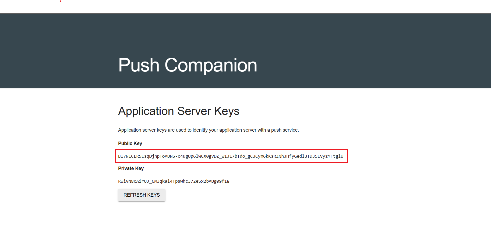
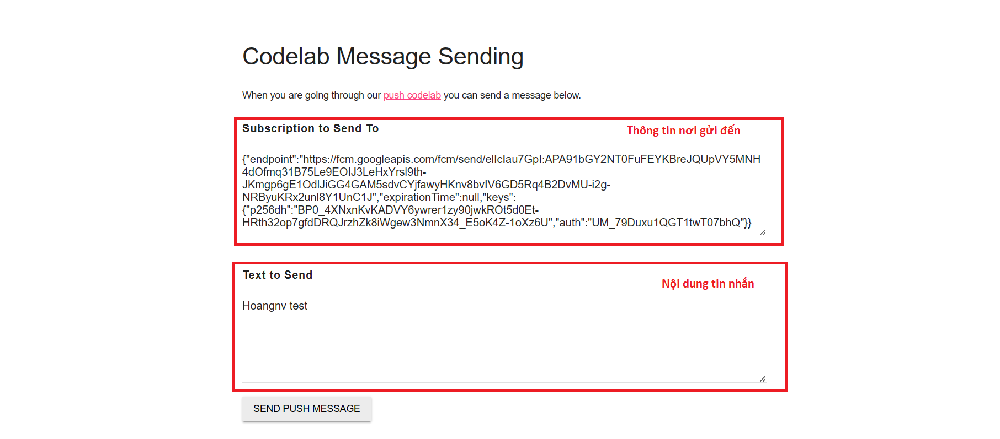

<h1>WEB PUSH NOTIFICATION</h1>
Push notification là cơ chế gửi thông báo cho người dùng từ website vào một sự kiện cụ thể nhằm đưa người dùng trở lại website giúp tăng tương tác giữa người dùng với website.

# Ưu điểm và nhược điểm của push notification

## Ưu điểm:

- Có thể gửi thông báo đến bất kỳ thiết bị nào hỗ trợ trình duyệt và trình duyệt đó hỗ trợ push notification.
- Người dùng không cần phải cài đặt các phần mềm hỗ trợ nào.
- Người dùng có thể nhận được thông báo ngay cả khi đang duyệt website khác.
- Tăng tương tác giữa web và người dùng.

## Nhược điểm:

Việc gửi push notification liên tục hoặc notify không có nội dung cụ thể, không đúng thời điểm có thể dẫn tới việc phản tác dụng của push notification.
#Các phiên bản browser hỗ trợ

## Phiên bản trên PC

<table>
  <tr>
    <th><strong>Chrome</strong></th>
    <th><strong>Edge</strong></th>
    <th><strong>Safari</strong></th>
    <th><strong>Firefox</strong></th>
    <th><strong>Opera</strong></th>
    <th><strong>IE</strong></th>
  </tr>
  <tr>
    <td>v22+</td>
    <td>v14+</td>
    <td>v6+ với Mac OSX 10.6+</td>
    <td>v22+</td>
    <td>v25+</td>
    <td>Không hỗ trợ</td>
  </tr>
</table>
##Phiên bản trên mobile:
<table>
  <tr>
    <th><strong>Chrome Android</strong></th>
    <th><strong>Safari iOS</strong></th>
    <th><strong>Samsung Internet</strong></th>
    <th><strong>Opera Min</strong></th>
    <th><strong>Opera Mobile</strong></th>
    <th><strong>UC Browser Android</strong></th>
    <th><strong>Android Browser</strong></th>
    <th><strong>Firefox for Android</strong></th>
    <th><strong>QQ Browser</strong></th>
    <th><strong>Baidu Browser</strong></th>
    <th><strong>KaiOS Browser</strong></th>
    <th><strong>Chrome IOS</strong></th>
  </tr>
  <tr>
    <td>v112</td>
    <td>v16.4+</td>
    <td>v4 với webkit</td>
    <td>Không hỗ trợ</td>
    <td>v73 với webkit</td>
    <td>v13.4</td>
    <td>v4.4 với webkit</td>
    <td>v110</td>
    <td>Không hỗ trợ</td>
    <td>Không hỗ trợ</td>
    <td>v2.5+</td>
    <td>check thấy v112.0.5615.167 chưa hỗ trợ</td>
  </tr>
</table>

- Chrome Android yêu cầu bắt buộc phải tạo 1 service worker.
- Firefox không hỗ trợ thông báo được gửi liền sát nhau.
- Thông báo của firefox sẽ biến mất trong vãi giây.
- IOS không hỗ trợ invisible push notifications (A silent push notification). Là những thông báo không có cảnh báo cho người dùng.

# Các bước thực hiện

## Khởi tạo

- Đầu tiên, ta cần tạo một file trống [sw.js](sw.js) được đặt cùng cấp thư mục với file [index.html](index.html). Đây sẽ là [service worker](https://developer.mozilla.org/en-US/docs/Web/API/Service_Worker_API) của bạn.
- Tiếp theo, ta sẽ tạo file [main.js](scripts\main.js), file này sẽ được load trong [index.html](index.html).

```HTML
<script src="scripts/main.js"></script>
```

- Tạo một biến toàn cục `pushButton` trong file [main.js](scripts\main.js) được gán với thẻ button `js-push-btn` trong [index.html](index.html)

```JavaScript
const pushButton = document.querySelector('.js-push-btn');
```

```HTML
<button disabled class="js-push-btn mdl-button mdl-js-button mdl-button--raised mdl-js-ripple-effect">
  Enable Push Messaging
</button>
```

- Tạo một biến toàn cục `swRegistration` lưu thông tin của service worker gán là null vì ban đấu service worker chưa được khởi tạo

```JavaScript
let swRegistration = null;
```

- Tạo một biến toàn bộ `isSubscribed` để kiểm tra người dùng đã đăng ký nhận thông báo hay không

```JavaScript
let isSubscribed = false;
```

## Lấy public key từ server

Vì đây là một sản phẩm demo nên ta sẽ thực hiện lấy public key và gửi thông báo từ một server demo có sẵn. Truy cập https://web-push-codelab.glitch.me/. Ở đây ta có thể thấy `Public Key` và `Private Key` như hình bên dưới:



Tạo một biến toàn cục `applicationServerPublicKey` và gán bằng giá trị `Public Key` mà ta vừa lấy được

```JavaScript
const applicationServerPublicKey = "Your public key";
```

## Tạo file [manifest.json](manifest.json) ([tài liệu tham khảo về manifest](https://developer.mozilla.org/en-US/docs/Web/Manifest))

```JSON
{
  "name": "test",
  "short_name": "test",
  "display": "standalone",
  "start_url": "/"
}
```

## Thêm file manifest vào [index.html](index.html)

```HTML
<link rel="manifest" href="/manifest.json">
```

## Hàm kiểm tra trong [main.js](scripts\main.js)

`checkIsWebPushSupported()` sẽ kiểm tra trình duyệt có hỗ trợ Notification, serviceWorker, pushManager và cập nhật text của button `pushButton`.

```JavaScript
async function checkIsWebPushSupported() {
  let str = '';
  if (!('Notification' in window)) {
    pushButton.textContent = 'Notification Not Supported';
    return false;
  } else if (!('serviceWorker' in navigator)) {
    pushButton.textContent = 'Service worker Not Supported';
    return false;
  } else {
    try {
      const sw = await navigator.serviceWorker.ready;
        if (!('pushManager' in sw)) {
          pushButton.textContent = 'Push Manager Not Supported';
          return false;
        }
        return true;
    } catch (error) {
      str += ('Error when check supported: ' + error + '\n');
      consoleBlock.innerText = consoleBlock.innerText + str;
      pushButton.textContent = 'Error supported';
      return false;
    }
  }
}
```

## Đăng ký service worker trong [main.js](scripts\main.js)

`handleLoading()` sẽ đăng ký file [sw.js](sw.js) là service worker sau khi đã kiểm tra trình duyệt có hỗ trợ push notification. Thực hiện thay đổi giao diện sau đã đăng ký thành công.

```JavaScript
async function handleLoading() {
  if (checkIsWebPushSupported) {
    if (window.navigator.serviceWorker !== undefined) {
      await window.navigator.serviceWorker.register('/sw.js')
      .then(function(swReg) {
        let str = ('Service Worker is registered\n');

        console.log('Service Worker is registered', swReg)

        swRegistration = swReg;
        initializeUI();
        consoleBlock.innerText = consoleBlock.innerText + str;
      })
      .catch(function(error) {
        let str = ('Service Worker Error: ' + error + '\n');
        consoleBlock.innerText = consoleBlock.innerText + str;
      });
    }
  } else {
    return;
  }
}
```

## Hàm khởi tạo giao diện trong [main.js](scripts\main.js)

`initializeUI()` sẽ kiểm tra xem người dùng đã đăng ký cho phép thông báo chưa, cập nhật hành động của button `pushButton` theo `isSubscribed` và cập nhật thông tin lên server (trong demo không có).

```JavaScript
function initializeUI() {
  let strConsole = '';
  pushButton.addEventListener('click', function() {
    pushButton.disabled = true;
    if (isSubscribed) {
      unsubscribeUser();
    } else {
      subscribeUser();
    }
  });

  // Set the initial subscription value
  navigator.serviceWorker.ready.then((serviceWorkerRegistration) => {
    serviceWorkerRegistration.pushManager.getSubscription()
    .then(function(subscription) {
      isSubscribed = !(subscription === null);

      updateSubscriptionOnServer(subscription);

      if (isSubscribed) {
        strConsole += 'User IS subscribed.\n';
      } else {
        strConsole += 'User is NOT subscribed.\n';
      }
      consoleBlock.innerText = consoleBlock.innerText + strConsole;

      updateBtn();
    })
  });
  consoleBlock.innerText = consoleBlock.innerText + strConsole;
}
```

## Hàm cập nhật trạng thái button `pushButton` trong [main.js](scripts\main.js)

`updateBtn()` kiểm tra người dùng có cho phép gửi thông báo không và update text, trạng thái của button `pushButton` theo `isSubscribed`.

```JavaScript
function updateBtn() {
  let strConsole = '';
  strConsole += (window.Notification.permission + '\n');
  if (window.Notification.permission === 'denied') {
    pushButton.textContent = 'Push Messaging Blocked';
    pushButton.disabled = true;
    updateSubscriptionOnServer(null);
    return;
  }

  if (isSubscribed) {
    pushButton.textContent = 'Disable Push Messaging';
  } else {
    pushButton.textContent = 'Enable Push Messaging';
  }

  pushButton.disabled = false;
  consoleBlock.innerText = consoleBlock.innerText + strConsole;
}
```

## Hàm đăng ký người dùng cho phép nhận thông báo trong [main.js](scripts\main.js)

- `userVisibleOnly` là tham số đảm bảo rằng sẽ hiển thị thông báo mỗi khi được gửi tới và nó phải là `true`.
- `applicationServerKey` là `applicationServerPublicKey` được chuyển đổi thành dạng Uint8Array thông qua hàm `urlB64ToUint8Array()`.
- Nếu người dùng không cung cấp quyền nhận thông báo thì `subscribe()` sẽ lỗi.

```JavaScript
function subscribeUser() {
  let strConsole = '';
  const applicationServerKey = urlB64ToUint8Array(applicationServerPublicKey);
  swRegistration.pushManager.subscribe({
    userVisibleOnly: true,
    applicationServerKey: applicationServerKey
  })
  .then(function(subscription) {
    strConsole += ('User is subscribed\n');
    consoleBlock.innerText = consoleBlock.innerText + strConsole;

    updateSubscriptionOnServer(subscription);

    isSubscribed = true;

    updateBtn();
  })
  .catch(function(error) {
    strConsole += ('Failed to subscribe the user: ' + error + '\n');
    consoleBlock.innerText = consoleBlock.innerText + strConsole;
    updateBtn();
  });
}
```

## Xử lý sự kiện nhận thông báo trong [sw.js](sw.js)

Trình duyệt nhận được thông báo sẽ tìm ra thông báo đó dành cho service worker nào, gọi service worker đó và hiện thông báo đó thông qua `showNotification()`. `showNotification()` yêu cầu bắt buộc thuộc tính `title`.

```JavaScript
self.addEventListener('push', function(event) {
  console.log('[Service Worker] Push Received.');
  console.log(`[Service Worker] Push had this data: "${event.data.text()}"`);

  const title = 'Push Codelab';
  const options = {
    body: event.data.text(),
    icon: 'images/icon.png',
    badge: 'images/badge.png'
  };

  const notificationPromise = self.registration.showNotification(title, options);
  event.waitUntil(notificationPromise);
});
```
### Xử lý sự kiện click vào thông báo trong [sw.js](sw.js)
Bắt sự kiện `notificationclick` khi thông báo hiện lên sẽ đóng thông báo và kiểm tra xem trình duyệt có đang mở url đặt trước không. Nếu có thực hiện focus vào url đó, nếu không thì mở url đó lên.
```JavaScript
self.addEventListener('notificationclick', function(event) {
  console.log('[Service Worker] Notification click received.');

  event.notification.close();

  event.waitUntil(
    clients
      .matchAll({
        type: "window",
      })
      .then((clientList) => {
        for (const client of clientList) {
          console.log("focus", client.url);
          if (client.url === "/" && "focus" in client) return client.focus();
        }
        if (clients.openWindow) return clients.openWindow("/");
      })
  );
});
```
## Thực hiện gửi thông báo cho người dùng
Truy cập vào website https://web-push-codelab.glitch.me/ dán thông tin sau khi đăng ký xong ở trên màn hình gồm (endpoint, expirationTime, keys) vào phần `Subscription to Send To`. Nhập nội dung muốn gửi đến vào phần `Text to Send` và nhấn "SEND PUSH MESSAGE"



## Hàm hủy đăng ký cho phép gửi thông báo trong [main.js](scripts\main.js)

```JavaScript
function unsubscribeUser() {
  let strConsole = '';
  swRegistration.pushManager.getSubscription()
  .then(function(subscription) {
    if (subscription) {
      return subscription.unsubscribe();
    }
  })
  .catch(function(error) {
    strConsole += ('Error unsubscribing' + error + '\n');
    consoleBlock.innerText = consoleBlock.innerText + strConsole;
  })
  .then(function() {
    updateSubscriptionOnServer(null);

    strConsole += ('User is unsubscribed.\n');
    consoleBlock.innerText = consoleBlock.innerText + strConsole;
    isSubscribed = false;

    updateBtn();
  });
}
```

#Tài liệu tham khảo
- https://caniuse.com/notifications
- https://developer.apple.com/documentation/usernotifications/sending_web_push_notifications_in_safari_and_other_browsers?language=objc
- https://codelabs.developers.google.com/codelabs/push-notifications#0
- https://bsscommerce.com/vi/web-push-notification/
- https://developer.mozilla.org/en-US/docs/Web/API/Notification
- https://developer.mozilla.org/en-US/docs/Web/API/Push_API
- https://developer.mozilla.org/en-US/docs/Web/Manifest
- https://zenn.dev/neriko/articles/2e0cde5f93ea95#web-push%E3%81%AE%E8%B3%BC%E8%AA%AD%E3%83%BB%E9%80%81%E5%8F%97%E4%BF%A1%E3%81%AE%E3%81%8A%E3%81%8A%E3%81%BE%E3%81%8B%E3%81%AA%E6%B5%81%E3%82%8C
- https://developer.mozilla.org/en-US/docs/Web/API/PushManager
- https://developer.mozilla.org/en-US/docs/Web/API/Notification